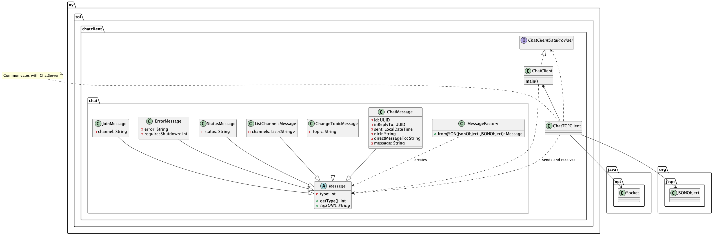

# O4 Chat Client


O4 Chat Client is a graphical user interface chat client app for Ohjelmointi 4 (Programming 4) course. 

This client uses the provided [O4-server](https://github.com/anttijuu/o4-server). 

This implementation is build around the [console version](https://github.com/anttijuu/O4-client) of the client.

## Server
The O4-server is a chat server with the following main properties:

* Clients connect to the server using a TCP socket.
* There is no authentication of users, just connect and start chatting.
* User nick's are not verified; several users can thus have the same nick. This may cause issues. 
* The chat messages are not saved nor buffered on the server side, so you cannot view old messages, sent before the client connected.
* The server supports chat *channels* you can join. Only clients on the same channel can view messages sent to the channel.
* Each channel can have a topic any user may change.
* You can reply to a specific chat message. 
* You can send *private messages* to a specific user using their nick. Note that the user must send at least one message; otherwise the server does not know the nick of the user and cannot forward any private messages to the user.
* You can join a server side bot channel. A bot channel reads messages from a text file and posts those periodically to the channel. 

## Structure


The client app is structured as described in this high level UML class diagram:



* `ChatClient` is the graphical user interface for the app, running the show.
*  `ChatClient` uses the `ChatTCPClient` to connect to and send/receive messages with the remote ChatServer. `ChatTCPClient` listens to messages from the server and converts them from JSON to `Message` objects, passing them then to `ChatClient` for handling.
* An abstract `Message` class forms the basis for all types of messages. Any `Message` can convert itself to a JSON String using the method `toJSON()`.
* `ChatMessage`s are the actual chat messages users sent to and received from the server to talk with each others.
* `ChangeTopicMessage` is used to request channel topic change as well as received by the client when the channel topic changes.
* `JoinMessage` is used by the client when it wants to join an existing channel or open a new channel.
* `ListChannelsMessage` can be sent by the client when user wishes to view available channels. It is also sent by the server as a reply, containing the currently open channels.
* `StatusMessage` is a message server can use to tell clients about interesting events happening in the server.
* `ErrorMessage` is used by the server when something goes wrong in the server side or client has sent an erroneus request. It can also contain a flag to instruct the client to shut down when the server is itself shutting down.
* `MessageFactory` can be used to create `Message` objects from the JSON received from the server.
* `ChatTCPClient` does not directly use `ChatClient`, but accesses it using the callback interface class `ChatClientDataProvider`. When the TCP client needs the settings (nick, server address, etc.), it asks these from the client using this interface the `ChatClient` implements.


## Building and running the client

This client can be run the same way as the [console version](https://github.com/anttijuu/O4-client) of the client. More detailed instructions can be found from the link above.


## Startup parameter and configuring the client

You must give the client one startup parameter, the client configuration file.

The client configuration file looks like this:

```config
server=localhost:10000
nick=nimimerkki
```

* `server` is the **host name** of the server separated by `:`, following with the **port number** the server is listening to for incoming client connections. If you run the server on the same machine where the client is, use `localhost`. Check that the port is the same server is configured to use. Note that the server name must be known, that is it is located on the same local network or on a public server with known host name DNS can find.
* `nick` is the default user name to use when client is connecting to the server. You can change the nick when the client is running.


